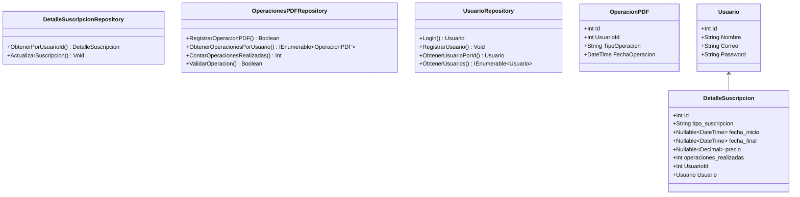

```mermaid
classDiagram

class DetalleSuscripcionRepository
DetalleSuscripcionRepository : +ObtenerPorUsuarioId() DetalleSuscripcion
DetalleSuscripcionRepository : +ActualizarSuscripcion() Void

class OperacionesPDFRepository
OperacionesPDFRepository : +RegistrarOperacionPDF() Boolean
OperacionesPDFRepository : +ObtenerOperacionesPorUsuario() IEnumerable~OperacionPDF~
OperacionesPDFRepository : +ContarOperacionesRealizadas() Int
OperacionesPDFRepository : +ValidarOperacion() Boolean

class UsuarioRepository
UsuarioRepository : +Login() Usuario
UsuarioRepository : +RegistrarUsuario() Void
UsuarioRepository : +ObtenerUsuarioPorId() Usuario
UsuarioRepository : +ObtenerUsuarios() IEnumerable~Usuario~

class DetalleSuscripcion
DetalleSuscripcion : +Int Id
DetalleSuscripcion : +String tipo_suscripcion
DetalleSuscripcion : +Nullable~DateTime~ fecha_inicio
DetalleSuscripcion : +Nullable~DateTime~ fecha_final
DetalleSuscripcion : +Nullable~Decimal~ precio
DetalleSuscripcion : +Int operaciones_realizadas
DetalleSuscripcion : +Int UsuarioId
DetalleSuscripcion : +Usuario Usuario

class OperacionPDF
OperacionPDF : +Int Id
OperacionPDF : +Int UsuarioId
OperacionPDF : +String TipoOperacion
OperacionPDF : +DateTime FechaOperacion

class Usuario
Usuario : +Int Id
Usuario : +String Nombre
Usuario : +String Correo
Usuario : +String Password


Usuario <-- DetalleSuscripcion

```
